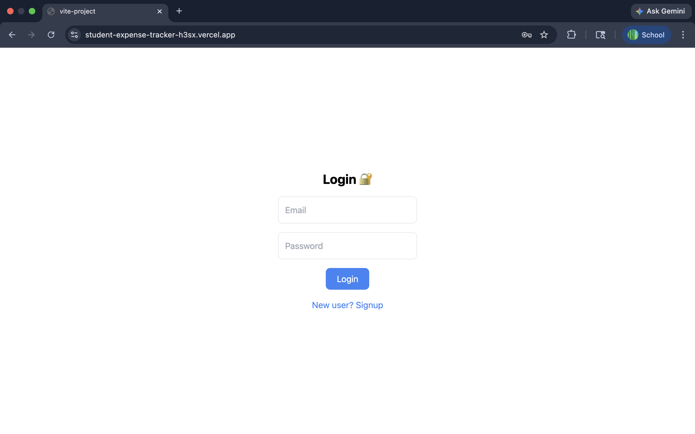
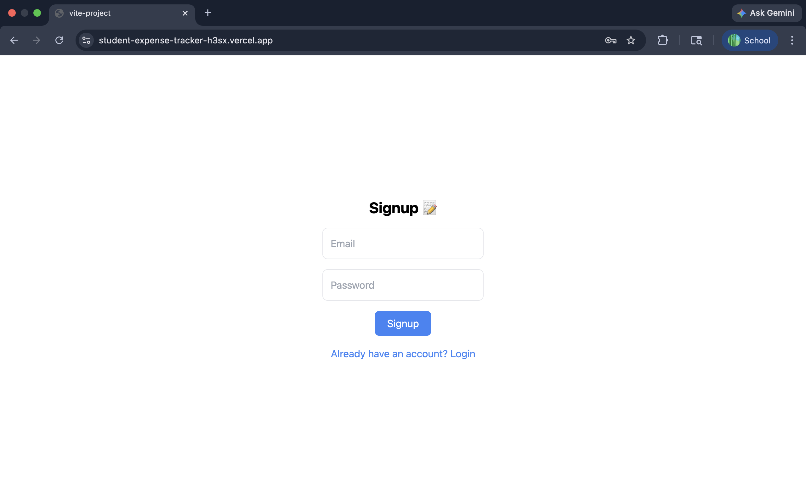
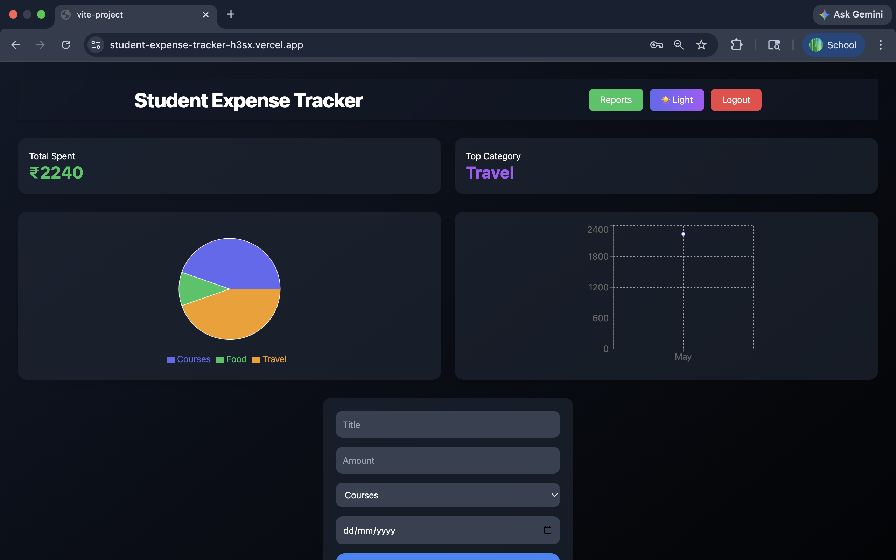
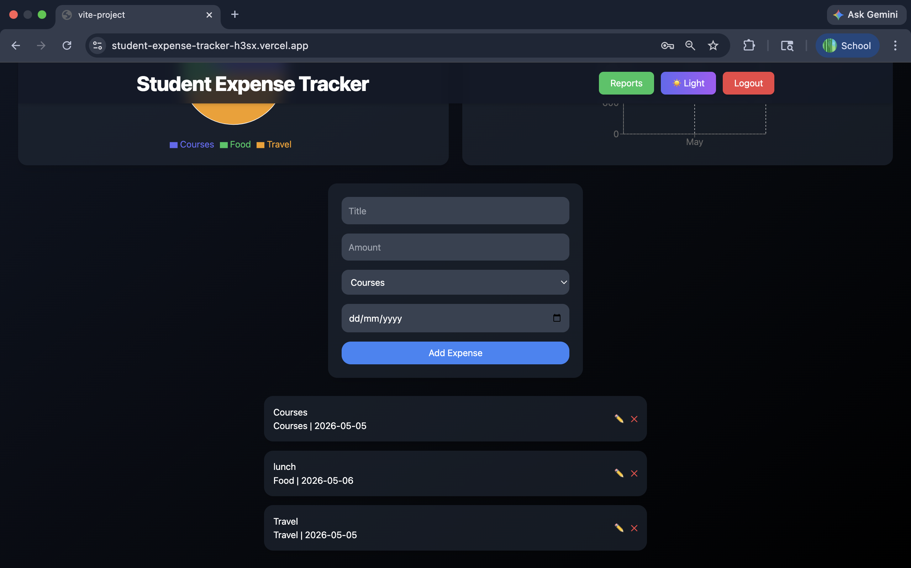

# 💰 Student Expense Tracker

A modern full-stack MERN web application designed to help students efficiently manage and analyze their daily expenses.  
The application provides secure authentication, personalized expense tracking, detailed reports, PDF export functionality, dark/light mode support, and interactive visual analytics.

---

# 🚀 Live Demo

🔗 https://student-expense-tracker-h3sx.vercel.app

---

# 🎥 Project Demo

📹 Complete working demo of the application has been included in the repository.

---

# ✨ Features

## 🔐 Authentication System
- User Signup & Login
- Secure user-based data handling
- Separate expense data for every account

## 💸 Expense Management
- Add Expenses
- Edit Existing Expenses
- Delete Expenses
- Categorize Expenses

## 📊 Analytics Dashboard
- Interactive Expense Dashboard
- Pie Chart Visualization
- Monthly Expense Analysis
- Daily Expense Reports
- Top Spending Category Detection
- Total Expense Tracking

## 📄 Reports & Export
- Daily Expense Reports
- Monthly Expense Reports
- Export Reports as PDF

## 🎨 UI/UX Features
- Dark Mode / Light Mode Toggle
- Responsive Design
- Modern Dashboard Interface
- Smooth User Experience

## 🌐 Deployment
- Fully Deployed Online
- Real-Time Database Integration
- Persistent User Data Storage

---

# 🛠️ Tech Stack

## Frontend
- React.js
- Vite
- Tailwind CSS
- Axios
- Recharts
- jsPDF
- html2canvas

## Backend
- Node.js
- Express.js

## Database
- MongoDB

## Deployment
- Vercel

---

# 📸 Screenshots

## 🔑 Login Page



---

## 📝 Signup Page



---

## 📊 Main Dashboard



---

## 💳 Expense Management Section



---

## 📅 Daily Expense Report


---

## 📆 Monthly Expense Report


---

# 📂 Project Structure

```bash
student_expense_tracker/
│
├── frontend/
│   ├── src/
│   ├── public/
│   └── package.json
│
├── backend/
│   ├── server.js
│   ├── User.js
│   └── package.json
│
├── README.md
└── vercel.json
```

---

# ⚙️ Installation & Setup

## Clone Repository

```bash
git clone https://github.com/Devanshi-Aggarwal/student_expense_tracker.git
```

---

## Frontend Setup

```bash
cd frontend
npm install
npm run dev
```

---

## Backend Setup

```bash
cd backend
npm install
node server.js
```

---

# Key Highlights

- Fully Functional MERN Stack Application
- Multi-User Authentication System
- Separate Database Records for Every User
- PDF Report Generation
- Interactive Data Visualization
- Responsive & Modern UI
- Live Deployment with Real Database Connectivity

---

# Future Improvements

- Budget Alerts
- AI-Based Spending Insights
- Recurring Expense Tracking
- Expense Search & Filters
- Mobile App Version
- Email Notifications

---

# Author

### Devanshi Aggarwal


